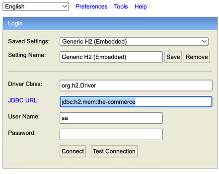

# UserProduct
더 커머스 백엔드 기술 과제 

회원 기능을 담당 하는 restful api 백엔드 서버

## Installation


1.&nbsp;**clone repository**
``` shell
git clone https://github.com/sunsik17/UserProduct.git 
```
2.&nbsp;**생성 된 프로젝트 디렉토리로 이동**
```shell
cd UserProduct
```
3.&nbsp;**dependencies**
```shell
./gradlew build
```
4.&nbsp;**application run**
```shell
java -jar build/libs/UserProduct-0.0.1-SNAPSHOT.jar
```

#### test (unit test code)
```shell
./gradlew test
```
**or**
```shell
./gradlew test -i
```

#### create users (테스트를 위한 100명 회원 생성)
```shell
curl --request POST 'http://localhost:8080/create-users'
```

## h2 db

어플리케이션 실행이 완료 되면
http://localhost:8080/h2-console 접속 후 아래 url로 jdbc url을 변경해 연결하면 데이터를 조회할 수 있다.
```
jdbc:h2:mem:the-commerce
```


## api 명세

http://localhost:8080/swagger-ui.html


## Skills
- language & framework


- database


## Project Tree

```
UserProduct
├── UserProductApplication.java
├── config
│   ├── JpaAuditingConfig.java
│   └── SwaggerConfig.java
├── controller
│   ├── test
│   │   └── TestController.java
│   └── user
│       └── UserController.java
├── domain
│   ├── BaseEntity.java
│   └── user
│       ├── dto
│       │   ├── RegisterUser.java
│       │   ├── UpdateUser.java
│       │   └── UserDto.java
│       ├── entity
│       │   └── User.java
│       └── repository
│           └── UserRepository.java
├── exception
│   ├── GlobalExceptionHandler.java
│   ├── UserServiceException.java
│   ├── contants
│   │   └── ErrorCode.java
│   └── dto
│       └── ErrorResponse.java
├── service
│   └── user
│       ├── UserReadService.java
│       └── UserRegisterService.java
└── util
    └── PageResult.java
```

## Features

### 회원 등록
- 입력 받은 id, password, nickname, username, mobile, email을 이용해 회원을 등록할 수 있다.
  - 중복 id 회원 가입 불가
  - 중복 닉네임 회원 가입 불가
  - 중복 모바일 회원 가입 불가
  - 중복 이메일 회원 가입 불가
- 닉네임은 2자 이상 6자 이하이다.

### 회원 수정
 - 기존에 가입 되어 있는 유저는 정보(email, nickname, password)를 수정 할 수 있다.
   - email, password, nickname 중 입력하지 않은 정보는 기존 상태를 유지한다. 

### 회원 목록 조회
 - username, createdAt 을 기준으로 오름차순 user 목록을 조회할 수 있다
 
## Log

로그 발생 시 최상위 logs 디렉토리가 만들어지고 하위에 log 파일들이 생성 된다.
- error이상의 로그를 담는 error_file.log
- info이상의 로그를 담는 log_file.log
